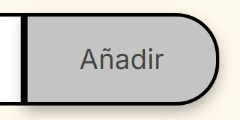
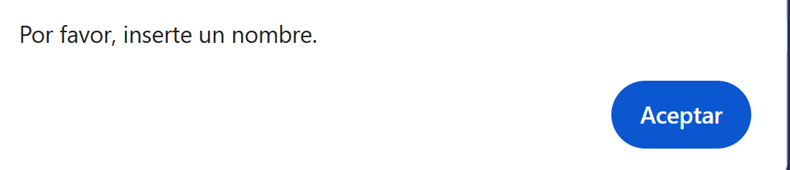
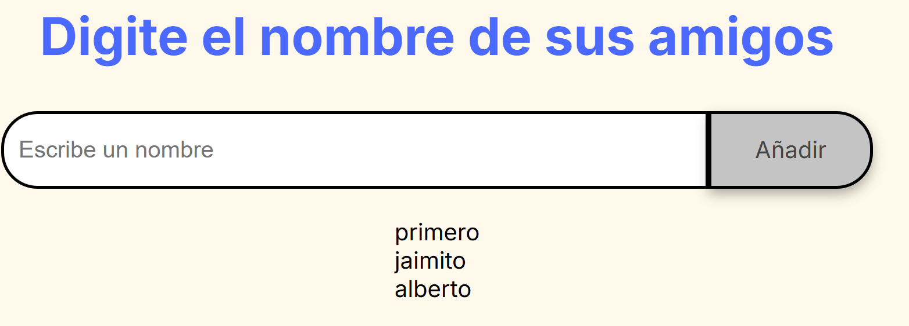
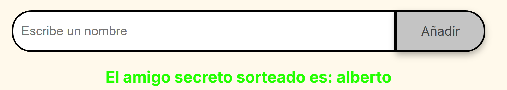

🎁 Sorteo de Amigo Secreto
¡Bienvenido al repositorio del Sorteo de Amigo Secreto! Este es un proyecto simple y divertido  que te permite organizar un sorteo de amigo secreto de forma rápida y sencilla. Simplemente agrega los nombres de tus amigos a una lista y deja que la aplicación elija un ganador aleatorio por ti.

✨ Funcionalidades
Este proyecto ofrece las siguientes características:

Agregar Nombres: Un campo de texto y un botón "Añadir" permiten a los usuarios agregar fácilmente los nombres de sus amigos a una lista.

Validación: Si intentas agregar un nombre vacío, se mostrará una alerta para asegurar que todos los nombres sean válidos.

Lista Visible: Los nombres que agregues se mostrarán en una lista en tiempo real, permitiéndote ver quiénes participan en el sorteo.

Sorteo Aleatorio: Con solo un clic en el botón "Sortear Amigo", la aplicación seleccionará de forma aleatoria un nombre de la lista y lo mostrará en pantalla.

🚀 ¿Cómo Usar?

Ingresa Nombres: En el campo de texto, escribe el nombre de uno de tus amigos.

Adiciona a la Lista: Haz clic en el botón "Adicionar" para agregar el nombre a la lista.

Repite: Continúa agregando a todos tus amigos hasta que la lista esté completa.

Realiza el Sorteo: Una vez que todos los nombres estén en la lista, haz clic en el botón "Sortear Amigo".

Descubre al Amigo Secreto: El nombre del amigo secreto elegido aleatoriamente aparecerá en la pantalla.

💻 Tecnologías Utilizadas
HTML: Para la estructura y el contenido de la página.

CSS: Para el estilo y la presentación visual.

JavaScript: Para la lógica de la aplicación, incluyendo la gestión de la lista, la validación y el sorteo aleatorio.

🤝 Contribuciones
Las contribuciones, informes de errores y sugerencias son siempre bienvenidas. Siéntete libre de abrir un issue o enviar un pull request.

Espero que esto te sirva de ayuda para empezar. Si necesitas más secciones o detalles, no dudes en pedírmelos.